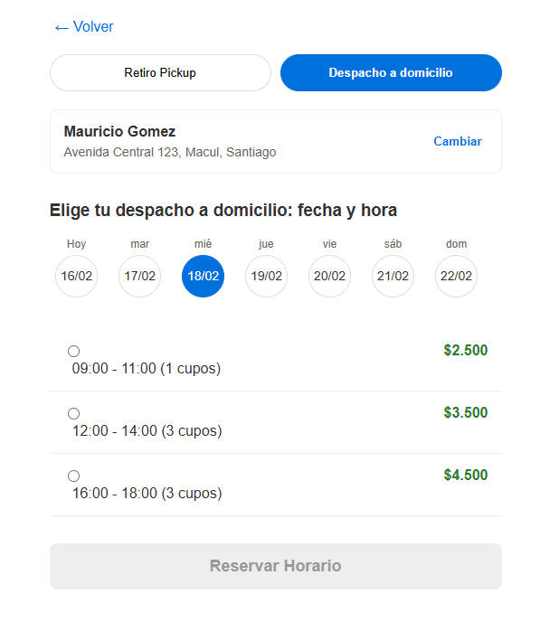
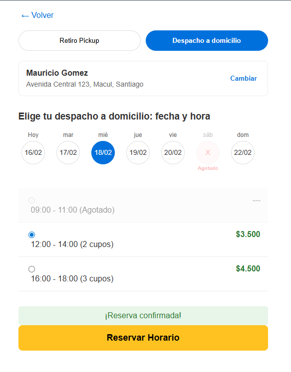

# Desafío Fullstack: Sistema de Ventanas de Despacho (Logística)

Este proyecto implementa un sistema de reserva de ventanas de despacho para órdenes de retail, considerando capacidad disponible y cobertura geográfica. El sistema garantiza consistencia bajo escenarios de alta concurrencia y sigue los estándares de desarrollo profesional en Java.

**Autor:** Mauricio Gomez

---

## 🚀 Tecnologías Utilizadas

* **Java 17/21**
* **Spring Boot 3.x**
* **Spring Data JPA**
* **H2 Database** (Base de datos en memoria para facilitar la evaluación)
* **Lombok** (Para reducción de código boilerplate)
* **Maven** (Gestor de dependencias)

---

## 🛠️ Decisiones de Arquitectura y Patrones de Diseño

Para este desafío se implementó una arquitectura limpia y escalable basada en los siguientes patrones:

1.  **Patrón de Abstracción (Service Interface):** Se definió `IDispatchService` para desacoplar la lógica de negocio del controlador, facilitando el testing y la mantenibilidad (Principios SOLID).
2.  **Pessimistic Locking (Bloqueo Pesimista):** Se implementó `@Lock(LockModeType.PESSIMISTIC_WRITE)` en las consultas críticas para evitar la sobre-reserva (over-booking) en entornos de alta concurrencia.
3.  **Global Exception Handling:** Centralización de errores mediante `@ControllerAdvice`, garantizando que la API siempre responda con un formato JSON estandarizado y códigos de estado HTTP correctos (404, 409, 500).
4.  **Repository Pattern:** Desacoplamiento de la capa de acceso a datos utilizando Spring Data JPA.
5.  **Javadoc Profesional:** Todo el código fuente cuenta con documentación Javadoc completa, detallando parámetros, retornos y excepciones.

---

## 📋 Requisitos Previos

* **JDK 17** o superior.
* **Maven 3.6** o superior.
* **IDE** (IntelliJ IDEA recomendado).

---

## ⚙️ Instrucciones para Ejecutar el Proyecto

El proyecto está configurado para ejecutarse sin necesidad de instalar bases de datos externas.

1.  **Clonar el repositorio:**
    ```bash
    git clone https://github.com/MauroGomezDev/walmartrepo.git
    cd walmart-challenge
    ```

2.  **Compilar e instalar dependencias:**
    ```bash
    mvn clean install
    ```

3.  **Ejecutar la aplicación:**
    * Desde la terminal: `mvn spring-boot:run`
    * O desde el IDE ejecutando la clase: `com.walmart.challenge.WalmartApplication`

4.  **Acceso a la API:**
    La aplicación iniciará en: `http://localhost:8080`

---

## 🧪 Calidad de Software y Pruebas

Para garantizar la robustez del sistema y facilitar la integración, se incluyeron las siguientes herramientas de verificación:

### 1. Pruebas Unitarias (JUnit 5 & Mockito)
Se implementaron tests unitarios para validar la lógica de negocio crítica en la capa de servicios, cubriendo los siguientes escenarios:
* **Flujo de Éxito:** Validación de reserva correcta y descuento de capacidad.
* **Reglas de Negocio:** Verificación de excepción `InsufficientCapacityException` cuando la capacidad es cero.
* **Manejo de Errores:** Validación de `ResourceNotFoundException` ante IDs inexistentes.

**Para ejecutar los tests:**
```bash
mvn test
---

## 🧪 Pruebas de la API (Endpoints)

El proyecto incluye un `DataSeeder` que carga datos automáticamente al iniciar.

### 1. Listar Ventanas Disponibles (GET)
Retorna el listado de ventanas con sus capacidades por zona.
* **URL:** `GET /api/v1/dispatch/windows`

### 2. Realizar una Reserva (POST)
Reserva un cupo en una ventana y zona específica.
* **URL:** `POST /api/v1/dispatch/reserve/{windowId}?zoneId={zoneId}`
* **Ejemplo de prueba (cURL):**
    ```bash
    curl -X POST "http://localhost:8080/api/v1/dispatch/reserve/w-20260128-1?zoneId=zone-1"
    ```

### 3. Prueba de Concurrencia y Errores
Si se intenta reservar más de la capacidad permitida (ej: 3 cupos), el sistema devolverá un error **409 Conflict**:
```json
{
  "timestamp": "2026-02-14T13:00:00",
  "status": 409,
  "error": "Conflict",
  "message": "No hay capacidad disponible para la zona: zone-1",
  "path": "/api/v1/dispatch/reserve/w-20260128-1"
}


```
###2. Colección de Postman
   En la raíz del repositorio se encuentra el archivo "REST API Walmart.postman_collection.json".

Endpoints incluidos: Listar ventanas y Realizar reserva.

Variables: Configurado para apuntar a localhost:8080 por defecto.

Uso: Importar el archivo en Postman para realizar pruebas manuales de forma rápida.

* **Automatización:** La colección utiliza un *Pre-request Script* para generar automáticamente los IDs basados en la fecha actual, asegurando que las pruebas funcionen cualquier día del año sin configuración manual.

---

## 🎨 Interfaz de Usuario (Frontend React)

Se desarrolló una aplicación complementaria en **React** para visualizar y gestionar las reservas de manera interactiva, basada en el ejemplo del requerimiento. Esta interfaz emula un flujo de checkout profesional (estilo Walmart) y fue desarrollada utilizando **Visual Studio Code**.

### 🌟 Características Principales
* **Selector Dinámico de Fechas:** Interfaz horizontal con círculos de fecha que se sincronizan automáticamente con el Backend.
* **Validación de Disponibilidad:** El sistema identifica días y horarios sin cupo, bloqueando las opciones y mostrando una etiqueta de **"Agotado"** de forma reactiva.
* **Integración con API REST:** Consumo de endpoints mediante `fetch` con manejo de estados de carga y error.
* **Experiencia de Usuario (UX):** Mensajes de confirmación y alertas de error basadas en la respuesta del `GlobalExceptionHandler` del backend.

### 🛠️ Tecnologías Frontend
* **React 18**
* **Node.js**
* **CSS3** (Diseño responsivo y componentes personalizados)
* **IDE:** Visual Studio Code

---

## ⚙️ Instrucciones para Ejecutar el Frontend

Para levantar la interfaz, asegúrate de que el Backend ya esté corriendo en el puerto `8080`.

1. **Navegar a la carpeta del frontend:**
   Desde la raíz del proyecto:
   ```bash
   cd dispatch-frontend

2. **Instalar dependencias de Node:**
   ```bash
   npm install

3. **Ejecutar la aplicación:**
```bash
npm start
```
La aplicación se abrirá automáticamente en: http://localhost:3000

### 📸 Vista Previa de la Interfaz
| Selección de Horarios | Confirmación de Reserva |
| :---: | :---: |
|  |  |

**Nota sobre la Interfaz:** La aplicación en React emula un flujo de checkout profesional. Para efectos de este desafío, la funcionalidad operativa se centra exclusivamente en la consulta de ventanas y la confirmación de reservas. Los demás elementos visuales (como los botones de perfil o métodos de entrega alternativos) son de carácter demostrativo para contextualizar la experiencia de usuario.

📂 Estructura Final del Proyecto Fullstack.
El proyecto se organiza de la siguiente manera:

Ecosistema Backend (IntelliJ IDEA): Ubicado en la raíz y carpeta src/. Contiene toda la lógica de persistencia y reglas de negocio en Java.

Ecosistema Frontend (VS Code): Ubicado en la subcarpeta dispatch-frontend/. Contiene los componentes, estilos y lógica de consumo de API en React.

---

### 🛡️ Estrategia de Concurrencia y Escalabilidad (Puntos Extra)

Para garantizar la consistencia absoluta de los datos y cumplir con el requerimiento de evitar sobre-reservas en entornos de alta demanda (como eventos de alta transaccionalidad o CyberDays), se definieron las siguientes estrategias:

#### 1. Implementación Actual: Consistencia Fuerte
Se optó por el uso de **Pessimistic Locking** (`SELECT FOR UPDATE`) mediante la anotación `@Lock(LockModeType.PESSIMISTIC_WRITE)`.
* **Justificación:** En un dominio crítico como la reserva de ventanas de despacho, la integridad del inventario es prioridad. Esta estrategia bloquea el registro en la base de datos desde la lectura hasta la confirmación de la reserva, garantizando que dos usuarios no puedan tomar el último cupo simultáneamente (*Race Condition*).

#### 2. Escalabilidad en Entornos de Producción
Para escalar esta solución a un entorno con millones de peticiones por segundo, propondría las siguientes optimizaciones:
* **Bloqueos Distribuidos (Redis/Redisson):** Movería la gestión de bloqueos de la base de datos relacional a una capa de caché distribuida. Esto reduce la latencia y evita el agotamiento del pool de conexiones de la base de datos principal.
* **Procesamiento Asíncrono:** Implementaría colas de mensajería (como RabbitMQ o Kafka) para encolar las peticiones de reserva en momentos de tráfico extremo, procesándolas de manera secuencial y notificando al usuario el resultado vía WebSockets o notificaciones push.
* **Optimistic Locking:** En bloques horarios con baja probabilidad de colisión, se podría alternar a un bloqueo optimista (usando la anotación `@Version`) para mejorar el throughput general del sistema.

---

